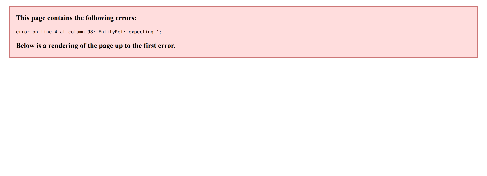

# zjobs

Local-first Go CLI that analyzes one job description (JD) against one profile + one CV variant and produces a Markdown + JSON fit report.

## What it does

Feed it **1 JD** (from URL, file, or pasted text) plus your **profile** (YAML) and a **CV variant** (Markdown), and `jdctl` emits a report with:

- **Verdict** — `Apply` / `Stretch` / `Skip`
- **Rubric score** — weighted across 6 axes (hard constraints, must-have skills, nice-to-have skills, seniority scope, domain context, evidence strength)
- **Evidence-backed gaps** — what the CV misses versus what the JD asks for
- **Prep pack (lite)** — top gaps, a few interview questions, verified references, and next actions

The tool is **read-only** for your profile/CV files — it never modifies them.

Semantic analysis (the JSON payload) is orchestrated by the Claude skills in `.claude/skills/`; Go validates that payload and computes the deterministic verdict, score, and report.

## Mental model



## Install / build

```sh
go build -o jdctl ./cmd/jdctl
# or with a version stamp:
go build -ldflags "-X zjobs/cmd/jdctl/cmd.version=v0.1.0" -o jdctl ./cmd/jdctl
```

## Usage

```sh
jdctl analyze jd \
  --profile ./data/profile.yaml \
  --cv ./data/cv-main.md \
  --url "https://example.com/job-posting" \
  --analysis ./data/analysis.json
```

JD input — exactly one of:

| Flag | Meaning |
|------|---------|
| `--url` | public JD URL |
| `--file` | path to a JD file |
| `--paste` | JD text pasted inline |

Other flags:

| Flag | Meaning |
|------|---------|
| `--profile` | path to profile YAML (required) |
| `--cv` | path to CV variant Markdown (required) |
| `--analysis` | path to the Claude analysis JSON (required) |
| `--out` | report output directory (default `./data/reports`) |
| `--config` | path to YAML config; defaults apply when empty |

Output on success:

```
verdict=Apply score=0.84
json=./data/reports/20260812-143000-analyzed.json
md=./data/reports/20260812-143000-analyzed.md
```

## Configuration

Copy `config.example.yaml` and adjust the rubric weights for the 6 scoring axes. Search provider settings live under `provider`; the MVP ships one real provider — **Exa** — configured via the `EXA_API_KEY` environment variable (preferred over committing a key in the config file).

## Tests

```sh
go test ./...
```

The suite includes unit tests per package, golden fixture assertions for the rubric/verdict/report contract, and an end-to-end smoke test (`internal/e2e`).

## Project layout

```
cmd/jdctl/          CLI entrypoint and `analyze jd` command
internal/ingest/    JD ingestion (URL / file / paste) + search providers
internal/domain/    profile, CV, and JD models + validation
internal/analysis/  analysis payload validation, 6-axis scoring, verdict
internal/reporting/ Markdown + JSON report build and write
internal/config/    YAML config loading (rubric weights, providers)
.claude/skills/     Claude skill files orchestrating the workflow
```

## License

MIT — see [LICENSE](LICENSE).
